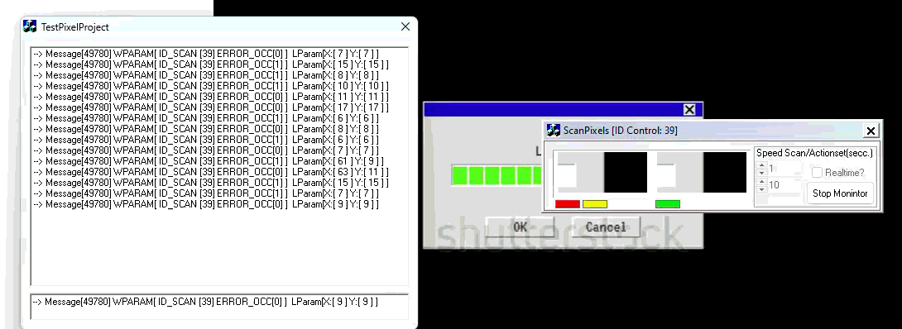

# ScanPixels

A Windows desktop pixel-monitoring tool, written in **Visual C++ / MFC** (originally authored 2012–2013, VC6 era, later upgraded to a modern Visual Studio solution).


 

The solution is made of **two cooperating applications** that talk to each other over a broadcast Windows message:

| Project | Role | What it does |
|---|---|---|
| **ScanPixels** | Sender / scanner | Captures a region of the desktop, scans pixels in real time, and broadcasts a registered Windows message whenever a pixel changes. |
| **TestPixelProject** | Receiver / demo client | Registers the same broadcast message and prints every event it receives (ID, error flag, X, Y) into a list. |

Together they demonstrate a simple but complete inter-process pixel-change notification system on Windows, using `RegisterWindowMessage` + `PostMessage(HWND_BROADCAST, ...)`.

---

## Table of contents

- [How it works](#how-it-works)
- [The protocol between the two apps](#the-protocol-between-the-two-apps)
- [ScanPixels — the scanner](#scanpixels--the-scanner)
- [TestPixelProject — the receiver](#testpixelproject--the-receiver)
- [Building](#building)
- [How to use it](#how-to-use-it)
- [Project layout](#project-layout)

---

## How it works

The idea is straightforward:

1. **ScanPixels** takes a snapshot of the desktop at the moment the user presses **Start**, blits it into a child frame on its dialog, and remembers where on the screen that snapshot came from.
2. On every timer tick, it picks the next pixel in a row-major sweep across that frame, reads the **frozen** color from the snapshot, then reads the **current** color from the live desktop at the matching screen coordinate.
3. If the two pixels differ, a "change detected" event is generated:
   - the dialog's status flags change color, and
   - a Windows message (`WHM_SCANPXL`) is **broadcast to every top-level window** carrying the client ID, an error flag, and the (X, Y) coordinate of the differing pixel.
4. **TestPixelProject** (or any other process that registers the same message name) receives every broadcast and can react to it — log it, trigger automation, sound an alarm, etc.

Because the channel is a registered broadcast message, the two apps are decoupled: the scanner does not need to know who is listening, and any number of listeners can run at the same time.

---

## The protocol between the two apps

Both apps register the same message name with `RegisterWindowMessage`:

```cpp
m_MsgPixelScan = ::RegisterWindowMessage(_T("WHM_SCANPXL"));
```

`RegisterWindowMessage` returns the same UINT system-wide for a given string, so the sender and any receiver agree on the message ID without hard-coding a number.

**ScanPixels** broadcasts events with:

```cpp
::PostMessage(HWND_BROADCAST,
              m_MsgPixelScan,
              MAKELONG(m_unIDClient, m_ErrorDetected),
              MAKELONG(m_nScanX, m_nScanY));
```

Payload layout:

| Param | High word | Low word |
|---|---|---|
| **WPARAM** | `m_ErrorDetected` (0 = match, 1 = fresh mismatch, 2 = mismatch already reported) | `m_unIDClient` (random per-instance ID, set in `OnInitDialog`) |
| **LPARAM** | `m_nScanY` (pixel Y inside the scan frame) | `m_nScanX` (pixel X inside the scan frame) |

`m_unIDClient` is generated at startup with a properly seeded `rand()` and shown in the dialog title (`ScanPixels [ID Control: <id>]`) so multiple scanners can be told apart by listeners.

---

## ScanPixels — the scanner

Source: `ScanPixels.cpp`, `ScanPixelsDlg.cpp` / `.h`, resources in `ScanPixels.rc`.

### Dialog controls

| ID | Type | Purpose |
|---|---|---|
| `IDC_BUTTON_START` | Button | Start / Stop monitoring. Captures a fresh desktop snapshot on every Start. |
| `IDC_STATIC_FLAMEPIXELS` | Static frame | The scan area — desktop snapshot is blitted here at start. |
| `IDC_STATIC_FLAG` | Static | Red when the current pixel matches the snapshot, black when it differs. |
| `IDC_STATIC_FLAG2` | Static | "Working" indicator — flashes red when a scan line wraps to the next row, yellow mid-scan. |
| `IDC_STATIC_FLAG3` | Static | Overall status — green when no error, red when an error is currently held. |
| `IDC_EDIT2` + `IDC_SPIN_SPEED` | Edit + Spin | Scan timer interval in ms (`m_unTimerSpeed`, default `10`). Lower = faster scanning. |
| `IDC_EDIT1` + `IDC_SPIN_ACTIONSET` | Edit + Spin | Action timer interval in ms (`m_unTimerAction`, default `1`). Controls how soon `WHM_SCANPXL` is fired after a state change. |
| `IDC_CHECK_REALTIME` | Checkbox | If checked, the action timer keeps firing on every tick — listeners receive a continuous stream while the state holds. If unchecked, the action timer fires **once per state transition** and is killed afterwards (edge-triggered). |

### Internal flow

1. **`OnInitDialog`**
   - Registers a custom window class with a black background brush.
   - Builds a rounded / cut region for the scan frame (`CreateHole`).
   - Creates the inner frame window `m_hWndFrame` as a child of `IDC_STATIC_FLAMEPIXELS`.
   - Configures spin ranges, default speed (`10`) and action delay (`1`).
   - Seeds `rand()` with `GetTickCount()` and uses it to generate `m_unIDClient`; writes the title bar.

2. **`OnButtonStart`** — toggles monitoring (clean two-branch state machine).
   - When **stopped** → takes a fresh snapshot via `CaptureWnd(GetDesktopWindow(), m_hWndFrame, TRUE)`, which `BitBlt`s the desktop pixels into the frame at `(m_nxSrc + kCaptureOffsetX, m_nySrc + kCaptureOffsetY)`. Resets scan position and edge-detection flags. Starts `TIMER_SCAN` at `m_unTimerSpeed` ms. Sets `m_bContinues = true`. Disables the speed/edit/checkbox/action controls. Label becomes "Stop Monitor".
   - When **running** → kills both timers, sets `m_bContinues = false`, re-enables the controls, label becomes "Start Monitor".

3. **`OnTimer` (timer `TIMER_SCAN` — scan tick)**
   - Increments `m_nScanX`. When it reaches half the frame width, wraps back to `kScanStartX`, increments `m_nScanY`, and flashes `IDC_STATIC_FLAG2` red. When `m_nScanY` reaches the frame height, wraps back to `kScanStartY`. This produces a true 2D row-major sweep of the scan area.
   - Calls `ComparePixels(m_nScanX, m_nScanY)`.

4. **`ComparePixels(nX, nY)`** (returns `TRUE` when pixels differ)
   - Reads `ddcFrame.GetPixel(nX, nY)` — the **frozen** snapshot pixel.
   - Reads `ddcDesktop.GetPixel(m_nxSrc + kCaptureOffsetX + nX, m_nySrc + kCaptureOffsetY + nY)` — the **live** desktop pixel at the matching screen position.
   - If equal → `IDC_STATIC_FLAG` red, clear that cell in `m_Error`, `m_ErrorDetected = kErrorNone`.
   - If different → `IDC_STATIC_FLAG` black, mark `m_Error[nX][nY] = nX + nY`, `m_ErrorDetected = kErrorFresh`.
   - Updates `IDC_STATIC_FLAG3` (green / red).
   - On any **edge** (rising = OK→error, or falling = error→OK), schedules `TIMER_ACTIONSET` with delay `m_unTimerAction`.

5. **`OnTimer` (timer `TIMER_ACTIONSET` — action tick)**
   - Broadcasts `WHM_SCANPXL` (see protocol above) when `m_ErrorDetected != kErrorReported`.
   - If `IDC_CHECK_REALTIME` is **off**, kills `TIMER_ACTIONSET` so only one broadcast goes out per state change. If **on**, the timer is left running for continuous notifications.

6. **`OnMove`** — keeps `m_nxSrc`, `m_nySrc` in sync with the dialog's screen position so the live-pixel lookup follows the window.

> **Note:** Because the dialog itself sits over its own snapshot, `kCaptureOffsetX` (132) and `kCaptureOffsetY` (12) shift the live read so it targets the desktop *behind* the dialog, not the dialog's own pixels. Moving the window after pressing Start changes which area of the desktop is being compared against the original snapshot — pressing Start again grabs a fresh snapshot at the new position.

---

## TestPixelProject — the receiver

Source: `TestPixelProject/TestPixelProjectDlg.cpp` / `.h`.

A minimal MFC dialog whose only job is to **prove the protocol works** by listening for `WHM_SCANPXL` broadcasts and showing every event.

### Dialog controls

| ID | Type | Purpose |
|---|---|---|
| `IDC_EDIT1` | Edit | Shows the most recent event as a formatted string. |
| `IDC_LIST1` | List box | Appends every event received. Double-click to clear the list. |

### How it listens

`OnInitDialog` registers the message once, and `WindowProc` filters every incoming message for it:

```cpp
BOOL CTestPixelProjectDlg::OnInitDialog()
{
    CDialog::OnInitDialog();
    // ...icon setup...
    m_MsgPixelScan = ::RegisterWindowMessage(_T("WHM_SCANPXL"));
    return TRUE;
}

LRESULT CTestPixelProjectDlg::WindowProc(UINT message, WPARAM wParam, LPARAM lParam)
{
    if (m_MsgPixelScan != 0 && message == m_MsgPixelScan)
    {
        CString strFormat;
        strFormat.Format(
            _T("--> Message[%u] WPARAM[ ID_SCAN [%u] ERROR_OCC[%u] ]  LParam[X:[ %u ] Y:[ %u ] ]"),
            message,
            LOWORD(wParam), HIWORD(wParam),
            LOWORD(lParam), HIWORD(lParam));
        SetDlgItemText(IDC_EDIT1, strFormat);
        m_ListCmd.AddString(strFormat);
    }
    return CDialog::WindowProc(message, wParam, lParam);
}
```

The fields are unpacked in the same order ScanPixels packs them, so the printout reads back: scanner client ID, error flag, X, Y.

Double-clicking the list (`OnDblclkList1`) calls `m_ListCmd.ResetContent()` to clear the log.

> **Why a separate process?** This is the core of the demo: `WHM_SCANPXL` is a broadcast message, so any application — running in any process, started before *or* after ScanPixels — that registers the same string with `RegisterWindowMessage` will pick the events up. TestPixelProject is the simplest possible such consumer.

---

## Building

The project targets **Win32 (x86)** and uses **MFC** with shared / static MFC libraries depending on configuration.

Two solution files are present, kept for historical reasons:

- `ScanPixels.dsp` / `ScanPixels.dsw` — original Visual C++ 6.0 workspace (1998 / 2002 era).
- `ScanPixels.sln` + `*.vcxproj` — modern Visual Studio solution (upgraded format, opens in VS 2010 and later, including VS 2022).

### Recommended (modern Visual Studio)

1. Open **`ScanPixels.sln`** in Visual Studio (2010 or later — tested with VS 2022).
2. The solution contains both projects: `ScanPixels` and `TestPixelProject`.
3. Make sure the active platform is **Win32** (the projects are 32-bit).
4. Choose **Build → Build Solution** (`Ctrl+Shift+B`). Both EXEs will be produced.
   - `ScanPixels.exe` lands in `Debug/` or `Release/` at the solution root.
   - `TestPixelProject.exe` lands in `TestPixelProject/Debug/` or `TestPixelProject/Release/`.

### Requirements

- Windows (the apps use Win32 + MFC + GDI directly — they do not run on non-Windows platforms).
- An MFC-capable Visual C++ toolset. In modern VS installers, install the workload **Desktop development with C++** and tick **MFC for v\* build tools** (Individual Components → MFC).

### Optional: original VC6 workspace

`ScanPixels.dsw` can still be opened by Visual C++ 6.0 if you want to see the project as it was originally authored. Modern Visual Studio will offer to upgrade it to a `.vcxproj` on open.

---

## How to use it

1. **Start the listener first.** Run `TestPixelProject.exe`. It does nothing visible until events arrive.
2. **Run the scanner.** Run `ScanPixels.exe`. The title shows its randomly assigned client ID, e.g. `ScanPixels [ID Control: 12345]`.
3. **Position the window** over the area of the desktop you want to monitor. The "scan frame" inside the dialog is the region that will be sampled.
4. **Adjust the timers** (optional):
   - **Speed** (`IDC_EDIT2` / spin) — milliseconds between scan ticks. `10` is a good starting value; smaller = faster but heavier on CPU.
   - **Action set** (`IDC_EDIT1` / spin) — milliseconds before the broadcast fires after a state change.
   - **Real-time** checkbox — leave **on** to receive a continuous stream while a difference persists; turn **off** to receive **one** notification per transition (edge-triggered).
5. **Press `Start Monitor`.** ScanPixels takes a fresh desktop snapshot of the area behind the frame and starts a row-major sweep across the scan area. The flags on the dialog reflect live status:
   - Green flag → all sampled pixels match the snapshot.
   - Red flag → at least one pixel has changed since the snapshot was taken.
6. **Watch TestPixelProject.** Every state change appears as a new line in the list:

   ```
   --> Message[49xxx] WPARAM[ ID_SCAN [12345] ERROR_OCC[1] ]  LParam[X:[ 27 ] Y:[ 27 ] ]
   ```

   - `ID_SCAN` — which scanner sent it (multiple ScanPixels instances can run at once).
   - `ERROR_OCC` — `0` = pixels match, `1` = fresh mismatch, `2` = mismatch already reported (suppressed unless real-time is on).
   - `X`, `Y` — coordinate inside the scan frame where the difference was found.

7. **Press `Stop Monitor`** to halt scanning. The control fields become editable again so you can adjust speeds and start a new run.
8. **Double-click** the list in TestPixelProject to clear it.

### Running multiple scanners or multiple listeners

Because the channel is a system-wide broadcast keyed by message name:

- You can run **N** copies of `ScanPixels.exe` over different desktop regions; each gets its own `m_unIDClient` and listeners can distinguish them.
- You can run **N** copies of `TestPixelProject.exe` (or any custom listener that registers `WHM_SCANPXL`); all of them receive every event.

---

## Project layout

```
ScanPixels/
├── ScanPixels.sln                  Modern VS solution (contains both projects)
├── ScanPixels.dsw / .dsp           Original VC6 workspace (kept for history)
├── ScanPixels.cpp / .h             CScanPixelsApp — the MFC application class
├── ScanPixelsDlg.cpp / .h          CScanPixelsDlg — main dialog, scanning + broadcast logic
├── ScanPixels.rc                   Dialog template, icons, resources
├── resource.h                      Control IDs (IDC_*, IDD_*)
├── StdAfx.cpp / .h                 Precompiled header
├── res/                            Icons and .rc2 includes
│
└── TestPixelProject/
    ├── TestPixelProject.vcxproj    Project file
    ├── TestPixelProject.cpp / .h   CTestPixelProjectApp
    ├── TestPixelProjectDlg.cpp/.h  CTestPixelProjectDlg — listener, formats events
    ├── TestPixelProject.rc         Dialog template
    ├── resource.h
    ├── StdAfx.cpp / .h
    └── res/
```

> Build artifact directories (`Debug/`, `Release/`, `Release_Bin1/`, `.vs/`, `Backup/`) and IDE-state files (`*.suo`, `*.opt`, `*.aps`, `*.ncb`, `*.user`) are not part of the source — they are produced by the build and can be safely deleted at any time.

---

## License

Personal / educational project. No license has been declared.
